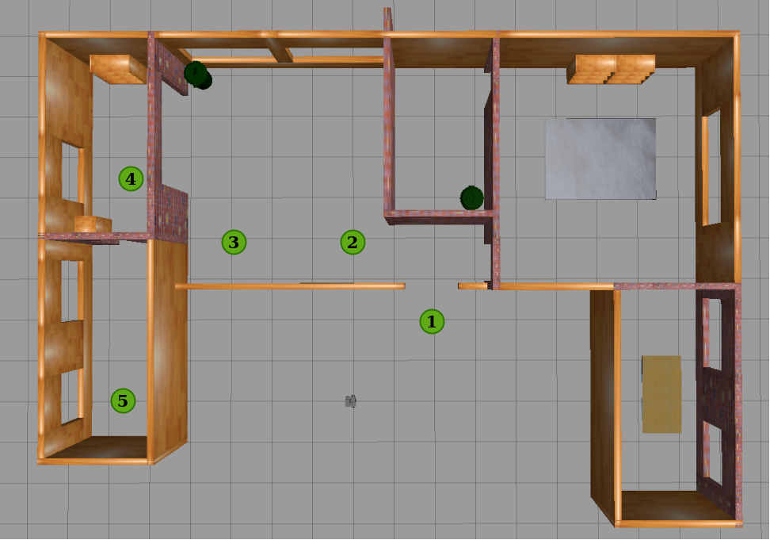
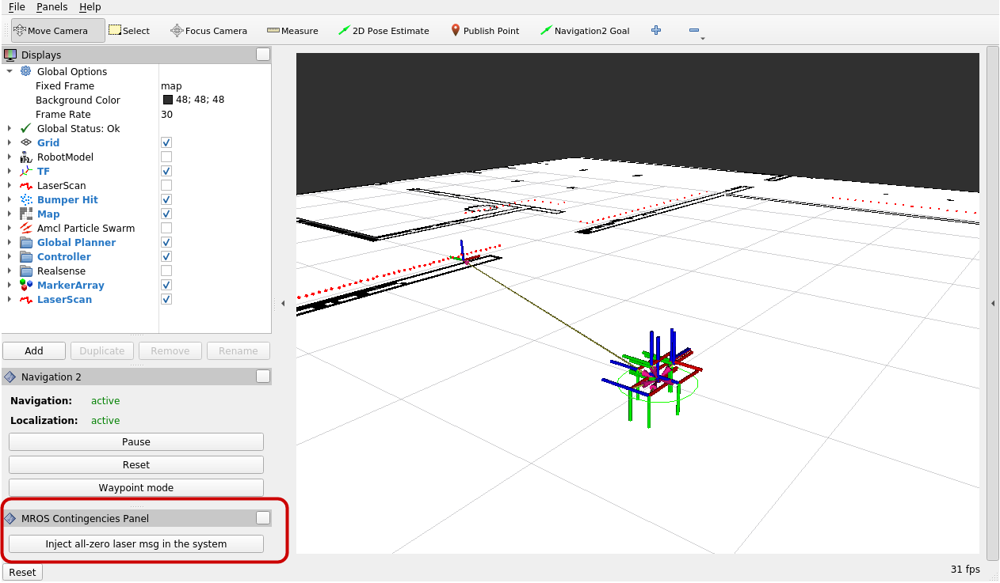
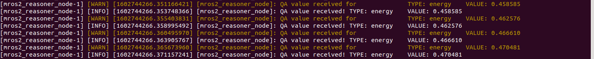

# navigation_experiments_mc_bts_pddl
A tutorial to get the MROS ecosystem fully working to perform the experiments programming a navigation task with metacontrol, with behavior trees and PDDL.

## Table of Contents
1. [Installing MROS Ecosystem](#installing-mros-ecosystem)
2. [Starting with a Turtlebo3 in Gazebo](#starting-with-a-turtlebo3-in-gazebo)
3. [Navigation system](#navigation-launcher)
4. [The metacontroller](#launch-the-mros2-metacontroller)
5. [Patrol mission](#autonomous-navigation-patrol-mission)
6. [MROS managing contingencies](#mros-managing-contingencies)
  - [Laser failure](#laser-failure-management)
  - [Low battery](#low-battery-management)


## Installing MROS Ecosystem
MROS is develop under Ubuntu20.04 and ROS2 Foxy, you can find the ROS2 installation steps and the environment setup [here](https://index.ros.org/doc/ros2/Installation/Foxy/), [here](https://index.ros.org/doc/ros2/Tutorials/Colcon-Tutorial/#colcon) and [here](https://index.ros.org/doc/ros2/Tutorials/Colcon-Tutorial/#create-a-workspace).

The mros_reasoner uses [Owlready2](https://owlready2.readthedocs.io/en/latest/index.html) and Java to handle the ontologies and perform reasoning.
```console
  sudo apt-get install openjdk-14-jre
  pip3 install owlready2
```
We are focus in mobile robots and we are using the navigation2 package.
Fetch, build and install navigation2 stack:

```console
  source /opt/ros/foxy/setup.bash

  sudo apt install ros-foxy-slam-toolbox ros-foxy-gazebo-ros-pkgs python3-vcstool python3-rosdep2 python3-colcon-common-extensions

  cd [ros2_ws]/src
  wget https://raw.githubusercontent.com/MROS-RobMoSys-ITP/MROS-Hands-On/main/mros-hands-on.repos
  vcs import < resources.repos
  cd ..
  rosdep install -y -r -q --from-paths src --ignore-src --rosdistro foxy --skip-keys="turtlebot2_drivers map_server astra_camera amcl"
  colcon build --symlink-install
```

## Starting with a Turtlebo3 in Gazebo.
Let's start opening Gazebo with a tb3.
This launcher includes gazebo, pointcloud_to_laser, laser_driver_wrapper, and **[system-modes](https://github.com/micro-ROS/system_modes)**.
The **system_modes mode_manager** takes the modes description from `navigation_experiments_mc_bts_pddl/params/pilot_modes.yaml`.

```console
  export GAZEBO_MODEL_PATH=$GAZEBO_MODEL_PATH:[ros2_ws]/src/turtlebot3/turtlebot3_simulations/turtlebot3_gazebo/models:[ros2_ws]/src/navigation_experiments_mc_bts_pddl/worlds/models
  export TURTLEBOT3_MODEL=${TB3_MODEL}
  ros2 launch navigation_experiments_mc_bts_pddl tb3_sim_launch.py
```
- After the last command, Gazebo window is opened and you should see a tb3 in a domestic scenario.

## Navigation launcher.
This launcher includes rviz, nav2, amcl, and map-server.

```console
  ros2 launch navigation_experiments_mc_bts_pddl nav2_turtlebot3_launch.py
```
- RVIz opens, and the navigation system is waiting for the activation of the laser_driver. This activation will be made automatically by the metacontroller in the next step. It is not necessary to set an initial robot position with the 2D Pose Estimate tool. When the laser_driver is up, the pose will be set automatically.

## Launch the mros2 metacontroller.
This step launches the `mros2_metacontroller`, it launches by default the `kb.owl` ontology and connects to the system_modes created by the pilot_urjc.
- The names of the modes there have been changed to match the `fd` names of the `kb.owl` ontology.
```console
  ros2 launch mros2_reasoner launch_reasoner.launch.py
```

## Autonomous navigation. Patrol mission.



We have developed a behavior to go through a set of waypoints autonomously. It is implemented using a simple [BehaviorTree](https://github.com/MROS-RobMoSys-ITP/Pilot-URJC/blob/master/pilot_behavior/behavior_trees/bt.xml)

```console
  ros2 launch pilot_behavior pilot_urjc_launch.py
```


## MROS managing contingencies.
Currently, we are supporting two contingencies, a laser sensor failure and battery low.

### Laser failure management.

#### Simulating a laser failure.

We have develop a RVIz tool to simulate a laser failure and its consequences. It injects all-zero laser messages in the system and forces the laser_wrapper to switch to error_processing state.



#### Managing the laser failure.

The [mros_modes_observer](https://github.com/MROS-RobMoSys-ITP/mros_modes_observer) package is used to monitor the status of the components (i.e. laser or other sensors) by subscribing to the [`[component_node]/transition_event`](https://github.com/ros2/rcl_interfaces/blob/master/lifecycle_msgs/msg/TransitionEvent.msg).

When the laser failure is detected, a message is sent to the metacontroller using the `/diagnostic` topic. 

```console
mros2_reasoner_node-1] [INFO] [1603183654.050846253] [mros2_reasoner_node]: Entered timer_cb for metacontrol reasoning
[mros2_reasoner_node-1] [INFO] [1603183654.052244011] [mros2_reasoner_node]:   >> Started MAPE-K ** Analysis (ontological reasoning) **
[mros2_reasoner_node-1] [WARN] [1603183654.625280278] [mros2_reasoner_node]: QA value received for	 	TYPE: laser_resender	VALUE: false
[mros2_reasoner_node-1] [INFO] [1603183654.781046611] [mros2_reasoner_node]: QA value received!	TYPE: laser_resender	VALUE: false
[mros2_reasoner_node-1] [INFO] [1603183654.781165253] [mros2_reasoner_node]:      >> Finished ontological reasoning)
```

- The metacontroller then sets all the modes that use this component as not realisable. This is done through `fd_realisability` with value `false`.
- If the current mode is using this component, a reconfiguration is trigger. This is because the current mode is a function grounding of a not realisable function design.
- The metacontroller searchs the for a new mode that does not use the component in error, for this pilot it's only the `f_degraded_mode`.

### Low battery management.

#### Simulating the battery drining.

The battery of the robot is drining based on the movements of the robot. The metacontroller window shows the battery consumption (0.0 - 1.0). This battery level represents the Energy QA for the metacontroller.



- The battery level is sent to the metacontroller as a QA value using the `/diagnostic` topic (See https://github.com/ros2/common_interfaces/blob/foxy/diagnostic_msgs/msg/DiagnosticArray.msg)

```
mros2_reasoner_node-1] [INFO] [1603183654.050846253] [mros2_reasoner_node]: Entered timer_cb for metacontrol reasoning
[mros2_reasoner_node-1] [INFO] [1603183654.052244011] [mros2_reasoner_node]:   >> Started MAPE-K ** Analysis (ontological reasoning) **
[mros2_reasoner_node-1] [WARN] [1603183654.625280278] [mros2_reasoner_node]: QA value received for	 	TYPE: energy	VALUE: 0.493473
[mros2_reasoner_node-1] [INFO] [1603183654.781046611] [mros2_reasoner_node]: QA value received!	TYPE: energy	VALUE: 0.493473
[mros2_reasoner_node-1] [INFO] [1603183654.781165253] [mros2_reasoner_node]:      >> Finished ontological reasoning)
```

- When the battery goes over a gthreshold `0.5`  a reconfiguration is required
- The metacontroller searchs the for a new mode, and marks the current one as failed.

```
[mros2_reasoner_node-1] FGs:
[mros2_reasoner_node-1] [INFO] [1603183666.750156602] [mros2_reasoner_node]: QA value received!	TYPE: energy	VALUE: 0.538985
[mros2_reasoner_node-1] WARNING:root: fg_f_performance_mode	objective: kb_hands_on.o_navigateA	status: None	FD: kb_hands_on.f_performance_mode, 	QAvalues: [('energy', 0.538985)]
[mros2_reasoner_node-1] WARNING:root:
[mros2_reasoner_node-1] OBJECTIVE	|  STATUS	|  NFRs
[mros2_reasoner_node-1] WARNING:root:o_navigateA	|  INTERNAL_ERROR	|  [('energy', 0.5), ('safety', 0.5)]
[mros2_reasoner_node-1] [WARN] [1603183666.751149736] [mros2_reasoner_node]: Objectives in status ERROR: ['o_navigateA']
[mros2_reasoner_node-1] [INFO] [1603183666.751405032] [mros2_reasoner_node]:   >> Finished MAPE-K ** ANALYSIS **
[mros2_reasoner_node-1] [INFO] [1603183666.751651488] [mros2_reasoner_node]:   >> Started MAPE-K ** PLAN adaptation **
[mros2_reasoner_node-1] [INFO] [1603183666.751896213] [mros2_reasoner_node]: => Reasoner searches FD for objective: o_navigateA
[mros2_reasoner_node-1] WARNING:root:== FunctionDesigns available for obj: ['f_degraded_mode', 'f_energy_saving_mode', 'f_normal_mode', 'f_performance_mode', 'f_slow_mode']
[mros2_reasoner_node-1] WARNING:root:Objective NFR ENERGY: [kb_hands_on.nfr_energy, kb_hands_on.nfr_safety]
[mros2_reasoner_node-1] WARNING:root:== Checking FDs for Objective with NFRs type: energy and value 0.5 
[mros2_reasoner_node-1] WARNING:root:== FunctionDesigns also meeting NFRs: ['f_slow_mode']
[mros2_reasoner_node-1] WARNING:root:> Best FD available f_slow_mode
```
- The new mode is changed using the `/change mode` service provided by the system modes. 

```
[mros2_reasoner_node-1] [INFO] [1603183666.752534090] [mros2_reasoner_node]:   >> Finished MAPE-K ** Plan adaptation **
[mros2_reasoner_node-1] [INFO] [1603183666.752783762] [mros2_reasoner_node]:   >> Started MAPE-K ** EXECUTION **
[mros2_reasoner_node-1] [WARN] [1603183666.753033650] [mros2_reasoner_node]: New Configuration requested: f_slow_mode
[mros2_reasoner_node-1] [INFO] [1603183666.757148442] [mros2_reasoner_node]: Got service result True
[mros2_reasoner_node-1] [INFO] [1603183666.759040367] [mros2_reasoner_node]: = RECONFIGURATION SUCCEEDED =
[mros2_reasoner_node-1] [INFO] [1603183666.759511555] [mros2_reasoner_node]:   >> Finished MAPE-K ** EXECUTION **
```

